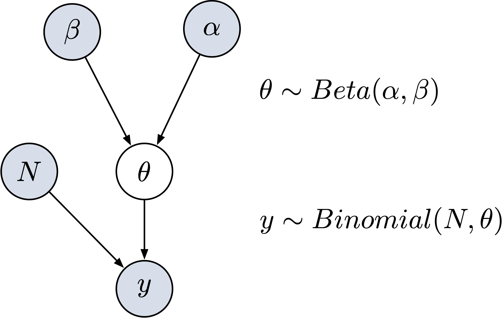
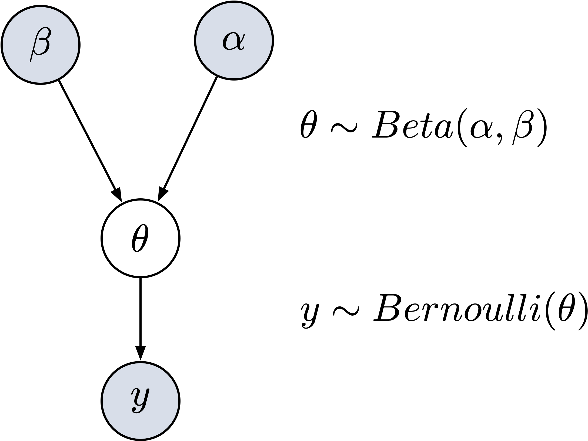

```{r setup, include=FALSE}
knitr::opts_chunk$set(echo = TRUE, cache = TRUE)
```


In der Forschung und Diagnostik interessieren uns oft Eigenschaften eines Prozesses oder einer Person, welche wir nicht direkt messen können. Deshalb werden Testverfahren und Experimente angewendet um diese latenten Variablen messbar zu machen. Mit statistischen Verfahren wird dann versucht aus den gemessenen Daten Informationen über die interessierende Eigenschaft zu erhalten. 

Uns kann beispielsweise die Aufmerksamkeitsleistung interessieren, welche wir mit einem Testverfahren für Aufmerksamkeit zu messen versuchen. Eine Neurowissenschaftlerin, welche sich für den Prozess von Aufmerksamkeit interessiert, würde versuchen die Aufmerksamkeitsleistung von vielen Leuten unter verschiedenen Bedingungen zu messen um zu untersuchen, durch was Aufmerksamkeit beeinflusst wird.  Ein klinischer Neuropsychologe hingegen hätte vielleicht das Ziel festzustellen, ob die Aufmerksamkeitsleistung einer Person von der Norm abweicht, beispielsweise weil sie durch einen Unfall eine Kopfverletzung erlitten hat. Beide messen Daten und beide ziehen aus den gemessenen Daten Rückschlüsse auf eine unterliegende Eigenschaft eines Prozesses oder einer Person. 

Wie das gemacht werden kann wird nachfolgend mit dem in Kapitel 1 eingeführten Beispiel [Link] der beiden Spielerinnen erklärt.


## Parameterschätzung: Parameter einer Binomialverteilung

Wenn eine Spielerin A gegen Spielerin B spielt und 6 von 9 Spielen gewinnt, kann gefragt werden, ob Spielerin A besser ist als Spielerin B, also ob Spielerin A die höhere Wahrscheinlichkeit hat, das nächste Spiel zu gewinnen als Spielerin B. Wir interessieren uns für die Wahrscheinlichkeitsverteilung von einer latenten Eigenschaft, hier aufgeschrieben als Parameter  $\theta$. Da wir $\theta$ nicht direkt messen können, möchten wir es aufgrund der bisher gemessenen Daten schätzen. In unserem Beispiel ist $\theta$ ein Parameter einer Binomialverteilung:

Die Binomial Likelihood ist gegeben durch

$$ P(x = k) = {n \choose k} \theta^k (1-\theta)^{n-k} $$

 
Wir haben folgende Daten beobachtet:

```{r}
wins <- 6
games <- 9
```


### Maximum Likelihood Schätzung


Die Maximum Likelihood Schätzung ergibt eine Punktschätzung des Parameters $\theta$. Dies ist der Parameterwert unter dem die beobachteten Daten am wahrscheinlichsten entstanden sind. Der grosse Nachteil einer Punktschätzung ist es, dass wir keine Wahrscheinlichkeitsverteilung erhalten. Es gäbe auch noch viele andere Parameterwerte, die dieses Ergebnis von 6 Siegen in 9 Spielen hervorbringen könnten, diese werden bei der Punktschätzung nicht beachtet. 

```{r}
theta <- wins/games
theta
```

Wenn man ganz viele Male diese Spiele wiederholen würde, dann würde man diese Messung am wahrscheinlichsten reproduzieren können, wenn man für $\theta$ den Wert `r theta` einsetzt. 

Um das zu veranschaulichen plotten wir die Wahrscheinlichkeit von 6 Siegen in 9 Spielen für alle Werte welche $\theta$ annehmen könnte. Diese Werte liegen zwischen 0 und 1, da wir von einer Wahrscheinlichkeit sprechen.

```{r}
library(tidyverse)
```

```{r echo=TRUE}
tibble(x = seq(from = 0, to = 1, by = .01)) %>% 
  mutate(density = dbinom(6, 9, x)) %>% 
  
  ggplot(aes(x = x, ymin = 0, ymax = density)) +
  geom_ribbon(size = 0, alpha = 1/4, fill = "steelblue") +
  geom_vline(xintercept = theta, linetype = 2, size = 1.2) +
  scale_y_continuous(NULL, breaks = NULL) +
  coord_cartesian(xlim = c(0, 1)) +
  xlab("Wahrscheinlichkeit") +
  theme(panel.grid = element_blank(),
        legend.position = "none")
```

Die Punktschätzung von $\theta$ wird mit der schwarzen gestrichelten Linie dargestellt. Doch eigentlich wissen wir mehr: Betrachtet man die hellblaue Fläche wird deutlich, dass auch etwas kleinere oder grössere Werte als die Punktschätzung mit grosser Wahrscheinlichkeit diese Daten hervorgebracht haben könnten. 

## Bayes' Theorem

In der Bayesianischen Statisik schaut man sich deshalb nicht nur eine Punktschätzung an, sondern die Wahrscheinlichkeitsverteilung von  $\theta$ unter den gemessenen Daten. Diese ergibt sich - wie im Bayes' Theorem formuliert - aus dem Produkt der Wahrscheinlichkeit der Daten unter den möglichen $\theta$ Werten und der Wahrscheinlichkeit von den  $\theta$ Werten normalisiert an der Wahrscheinlichkeit der Daten. Hier ist wichtig, dass wir eben eine Verteilung betrachten, also die Wahrscheinlichkeiten für ganz viele verschiedene Werte von  $\theta$.

$$ P(\theta|Data) = \frac{ P(Data|\theta) * P(\theta) } {P(Data)} $$
oder ohne Normalisierungskonstante: 

$$ P(\theta|Data) \propto P(Data|\theta) * P(\theta) $$


## Grid Approximation

Um diese Wahrscheinlichkeitsverteilung zu berechnen gibt es verschiedene Methoden. Eine davon ist die *grid approximation*. Diese ist rechnerisch sehr aufwändig und deshalb für komplizierte Modelle nicht geeignet. Die *grid approximation* zeigt aber anschaulich auf, wie wir eine Wahrscheinlichkeitsverteilung von $\theta$ schätzen können. Hierfür werden drei Schritte benötigt.

1. Erstellen einer *grid*-Variable

Wir erstellen eine Variable, welche eine eingeschränkte Menge an möglichen $\theta$-Werten beinhaltet. Anders ausgedrückt: Zwischen 0 und 1 gibt es unendlich viele Werte, wir schränken uns mit unserem *grid* auf eine begrenzte Zahl an Werten ein. Hier definieren wir unsere *grid*-Variable als 100 Punkte die gleichabständig zwischen 0 und 1 liegen.


```{r}
n_points <- 100
theta_grid <- seq(from = 0 , to = 1 , length.out = n_points)
```

2. Definieren der Prior Verteilung

Wir entscheiden uns für einen Prior, den wir für sinnvoll halten. Hier nehmen wir einen recht uninformativen Prior. Das bedeutet, dieser Prior enthält keine starken Vorannahmen, ob Spielerin A besser ist als Spielerin B. 

```{r}
prior <- dbeta(x = theta_grid, shape1 = 4,  shape2 = 4)

```

2. Errechnen der Posterior Verteilung aus Prior und Likelihood

```{r}
likelihood <- dbinom(wins , size = games , prob = theta_grid)
```
```{r}
prior <- dbeta(x = theta_grid, shape1 = 4,  shape2 = 4)

```
```{r}
unstandardized_posterior <- likelihood * prior
posterior <- unstandardized_posterior / sum(unstandardized_posterior)
```

```{r echo=TRUE}
d <- tibble(theta_grid, prior, likelihood, posterior)

d %>%
  pivot_longer(-theta_grid, names_to = "distribution", values_to = "density") %>% 
  mutate(distribution = as_factor(distribution)) %>% 
  ggplot(aes(theta_grid, density, color = distribution)) +
  geom_line(size = 1.5) +
  geom_vline(xintercept = 9/10, linetype = "dashed") +
  scale_color_viridis_d(end = 0.8) +
  xlab("Theta Werte") +
  ylab("") +
  facet_wrap(~distribution, scales = "free_y") +
  theme_bw() +
  theme(legend.position = "none")
```


# Posterior Verteilungen zusammenfassen

Statt einer Punktschätzung haben wir nun eine Wahrscheinlichkeitsverteilung des Parameters $\theta$. Nun möchten wir diese Verteilung nicht nur plotten können, sondern auch beschreiben. Eine Verteilung kann mit verschiedenen Angaben beschrieben werden. [LINK Kapitel 1].


 
Samples aus dem Posterior ziehen:


```{r}
n_samples <- 1e4
set.seed(3) # wegen Reproduzierbarkeit
```


```{r}
library(rmarkdown)
```
```{r echo=TRUE}
d %>%
    paged_table(options = list(rows.print = 6))
```


```{r}
samples <-
  d %>% 
  slice_sample(n = n_samples, weight_by = posterior, replace = TRUE) %>%
  mutate(sample_number = 1:n())
```


```{r echo=TRUE}
samples %>%
    paged_table(options = list(rows.print = 6))
```


```{r}
samples %>%
  ggplot(aes(x = sample_number, y = theta_grid)) +
  geom_point(alpha = 1/10) +
  scale_y_continuous("Erfolgswahrscheinlichkeit", limits = c(0, 1)) +
  xlab("sample number")
```


```{r echo=FALSE, message=FALSE, warning=FALSE}
samples %>% 
  ggplot(aes(x = theta_grid)) +
  geom_density(fill = "steelblue") +
  scale_x_continuous("Erfolgswahrscheinlichkeit", limits = c(0, 1))
```


## Intervalle mit definierten Endpunkten

### Posterior Approximation

```{r}
sum(posterior[theta_grid > 0.5])
```

```{r}
d %>% 
  filter(theta_grid > .5) %>% 
  summarise(sum = sum(posterior)) 
```

## Intervalle mit definierten Endpunkten

### Posterior Samples

```{r}
samples %>% #<<
  filter(theta_grid > .5) %>% #<<
  summarise(sum = n() / n_samples) #<<
```

```{r}
samples %>% 
  count(theta_grid > .5) %>% 
  mutate(probability = n / sum(n))
```


## Intervalle mit definierter Masse

### Quantile

```{r}
quantile(samples$theta_grid, prob = c(.25, .75))
```

```{r}
library(tidybayes)
median_qi(samples$theta_grid, .width = .5)
```


```{r}
library(tidybayes)
median_qi(samples$theta_grid, .width = c(.5, .8, .99))
```


### Highest Posterior Density (HPDI)

```{r}
mode_hdi(samples$theta_grid, .width = .5)
```

```{r}
hdi(samples$theta_grid, .width = .5)
```


```{r echo = TRUE}
library(patchwork)

p1 <-
  d %>% 
  ggplot(aes(x = theta_grid)) +
  # check out our sweet `qi()` indexing
  geom_ribbon(data = d %>% filter(theta_grid > qi(samples$theta_grid, .width = .5)[1] & 
                                    theta_grid < qi(samples$theta_grid, .width = .5)[2]),
              aes(ymin = 0, ymax = posterior),
              fill = "grey75") +
  geom_line(aes(y = posterior)) +
  labs(subtitle = "50% Percentile Interval",
       x = "Erfolgswahrscheinlichkeit",
       y = "density")


p2 <-
  d %>% 
  ggplot(aes(x = theta_grid)) +
  geom_ribbon(data = . %>% filter(theta_grid > hdi(samples$theta_grid, .width = .5)[1] & 
                                    theta_grid < hdi(samples$theta_grid, .width = .5)[2]),
              aes(ymin = 0, ymax = posterior),
              fill = "grey75") +
  geom_line(aes(y = posterior)) +
  labs(subtitle = "50% HPDI",
       x = "Erfolgswahrscheinlichkeit",
       y = "density")

p1 | p2
```


# Sampling: Simulation


```{r echo = FALSE}
set.seed(3)
d <- tibble(draws = rbinom(1e4, size = 9, prob = .7))

# the histogram
d %>% 
  ggplot(aes(x = draws)) +
  geom_histogram(binwidth = 1, center = 0,
                 color = "grey92", size = 1/10) +
  scale_x_continuous("Erfolge",
                     breaks = seq(from = 0, to = 9, by = 2)) +
  ylab("Häufigkeit") +
  coord_cartesian(xlim = c(0, 9)) +
  theme(panel.grid = element_blank())
```

```{r echo = TRUE}
n_draws <- 1e5

simulate_binom <- function(n, probability) {
  set.seed(3)
  rbinom(n_draws, size = n, prob = probability) 
}

d <-
  crossing(n           = c(3, 6, 9),
           probability = c(.3, .6, .9)) %>% 
  mutate(draws = map2(n, probability, simulate_binom)) %>% 
  ungroup() %>% 
  mutate(n           = str_c("n = ", n),
         probability = str_c("theta = ", probability)) %>% 
  unnest(draws)

d %>% 
  ggplot(aes(x = draws)) +
  geom_histogram(binwidth = 1, center = 0,
                 color = "grey92", size = 1/10) +
  scale_x_continuous("Erfolge",
                     breaks = seq(from = 0, to = 9, by = 2)) +
  ylab("Häufigkeit") +
  coord_cartesian(xlim = c(0, 9)) +
  theme(panel.grid = element_blank()) +
  facet_grid(n ~ probability)
```

# Prior Predictive Distribution

```{r echo = FALSE}
n_samples <- 1e4
n <- 100
n_success <- 6
n_trials <- 9

d <-
  tibble(theta_grid = seq(from = 0, to = 1, length.out = n),
         prior  = dbeta(theta_grid, shape1 = 4, shape2 = 4)) %>% 
  mutate(likelihood = dbinom(n_success, size = n_trials, prob = theta_grid)) %>% 
  mutate(posterior = (likelihood * prior) / sum(likelihood * prior))

samples <-
  d %>% 
  mutate(prior = prior/sum(prior)) %>%
  slice_sample(n = n_samples, weight_by = prior, replace = T) %>% 
  mutate(k = purrr::map_dbl(theta_grid, rbinom, n = 1, size = 9))

samples %>% 
  ggplot(aes(x = k)) +
  geom_histogram(binwidth = 1, center = 0,
                 color = "grey92", size = 1/10) +
  scale_x_continuous("Erfolge",
                     breaks = seq(from = 0, to = 9, by = 3)) +
  scale_y_continuous(NULL, breaks = NULL) +
  ggtitle("Prior predictive distribution") +
  coord_cartesian(xlim = c(0, 9),
                  ylim = c(0, 3000)) +
  theme(panel.grid = element_blank())
```


# Posterior Predictive Distribution

```{r echo = FALSE}
n_samples <- 1e4

# make it reproducible
set.seed(3)

samples <-
  d %>% 
  slice_sample(n = n_samples, weight_by = posterior, replace = T) %>% 
  mutate(k = purrr::map_dbl(theta_grid, rbinom, n = 1, size = 9))

samples %>% 
  ggplot(aes(x = k)) +
  geom_histogram(binwidth = 1, center = 0,
                 color = "grey92", size = 1/10) +
  scale_x_continuous("Erfolge",
                     breaks = seq(from = 0, to = 9, by = 3)) +
  scale_y_continuous(NULL, breaks = NULL) +
  ggtitle("Posterior predictive distribution") +
  coord_cartesian(xlim = c(0, 9),
                  ylim = c(0, 3000)) +
  theme(panel.grid = element_blank())
```


## Graphical model

### Binomial Model

Grafische Darstellung des  <span style="color: var(--text-color)">Generativen Modells</span>:

<aside>
```{r binomial-graphical-model, echo=FALSE, fig.cap="Graphical Model für binomialverteilte Daten."}

```
</aside>


<aside>
```{r bernoulli-graphical-model, echo=FALSE, fig.cap="Graphical Model für bernoulliverteilte Daten."}

```
</aside>


## Gaussian model

Grafische Darstellung eines  <span style="color: var(--text-color)">Generativen Modells</span> mit normalverteilten Daten:


<aside>
```{r normal-graphical-model, echo=FALSE, fig.cap="Graphical Model für normalverteilte Daten."}
knitr::include_graphics("images/normal-graphical-model.png")
```
</aside>

\@ref(fig:normal-graphical-model)

```{r}
n <- 20

mu_sigma <- 5

set.seed(6)
mu <- rnorm(n = 1, mean = 120, 
            sd = mu_sigma)
sigma <- runif(n = 1, 1, 10)
y <- rnorm(n = n, mean = mu, 
           sd = sigma) %>% 
     round(2)
```


```{r echo = TRUE}
hist(y, col = 'skyblue3', breaks = 10) 
```


## Posterior Inference

```{C++}
// The input data is a vector 'y' of length 'N'.
data {
  int<lower=0> N;
  vector[N] y;
}

// The parameters accepted by the model. Our model
// accepts two parameters 'mu' and 'sigma'.
parameters {
  real mu;
  real<lower=0> sigma;
}

// The model to be estimated. We model the output
// 'y' to be normally distributed with mean 'mu'
// and standard deviation 'sigma'.
model {
  mu ~ normal(120, 5);
  sigma ~ uniform(1, 10);
  y ~ normal(mu, sigma);
}
```


```{r}
library(brms)
d <- tibble(y)
```


```{r eval = FALSE}
priors <- set_prior("normal(120, 5)", class = "Intercept") +
    set_prior("uniform(1, 10)", class = "sigma")

fit <- brm(y ~ 1,
           family = gaussian,
           prior = priors,
           data = d,
           cores = parallel::detectCores())
```


## `brms` Model


```{r}
library(brms)
d <- tibble(y)
```

```{r}
get_prior(y ~ 1,
          family = gaussian,
          data = d)
```

```{r}
priors <- set_prior("normal(120, 5)", class = "Intercept") +
  set_prior("cauchy(0, 1)", class = "sigma")
```


```{r echo=TRUE, message=FALSE, warning=FALSE, results='hide'}
m <- brm(y ~ 1,
           family = gaussian,
           prior = priors,
           data = d,
           cores = parallel::detectCores(),
           file = "models/model_1")
```

```{r eval=FALSE, include=TRUE}
summary(m)
```

<aside>
Parameter werden durch Mittelwert, SD (Est.Error), 2-seitige 95% Credible
intervals der Posterior-Verteilung zusammengefasst.
</aside>


```{r}
plot(m)
```

```{r}
library(tidybayes)
```

```{r}
m %>%
  spread_draws(b_Intercept) %>% 
  median_qi(.width = c(.50, .80, .95)) %>% 
  kableExtra::kbl()
```


```{r}
m %>%
  spread_draws(b_Intercept) %>%
  ggplot(aes(x = b_Intercept)) +
  stat_halfeye(.width = c(.50, .80, .95))
```
