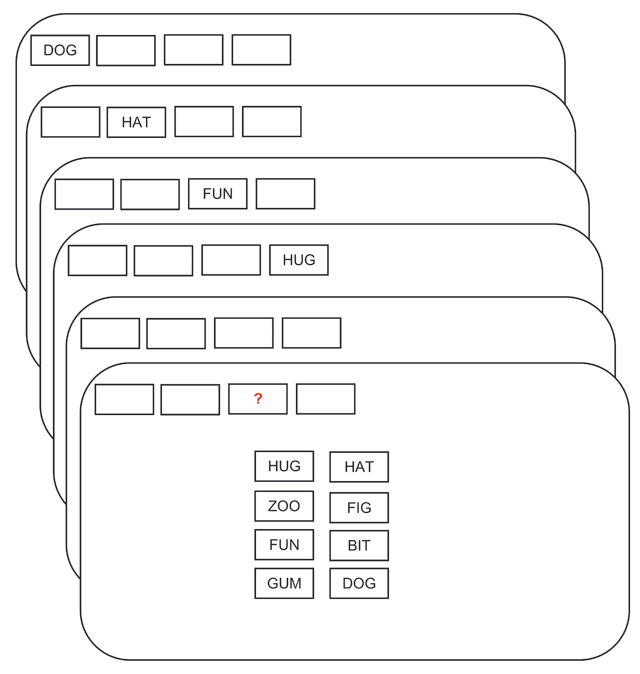

```{r setup, include=FALSE}
knitr::opts_chunk$set(echo = TRUE, cache = TRUE)

library(tidyverse)
library(rmarkdown)
library(kableExtra)
theme_set(theme_grey(base_size = 14) +
            theme(panel.grid = element_blank()))
```


# Logistische Regression

Wir untersuchen die Logistische Regression anhand eines Beispiels aus dem Online Buch [Bayesian Data Analysis for Cognitive Science](https://vasishth.github.io/bayescogsci/book/). Wir gehen hier der Frage nach ob die Anzahl Stimuli (Wortlisten unterschiedlicher Länge) einen Einfluss auf die Working Memory Kapazität hat.

Die Daten stammen aus @oberauerWorkingMemoryCapacity2019 Versuchspersonen wurden Wortlisten mit 2, 4, 6, oder 8 Elementen gezeigt (`set_size`), und sie mussten danach Wörter anhand ihrer Position wiedergeben.

Ein Trial dieses Experiments ist in Figure \@ref(fig:oberauer-2019) dargestellt.

```{r oberauer-2019, echo=FALSE, fig.cap="Ein Beipieltrial. Den Versuchspersonen wurden Wörter der einstudierten Liste gezeigt. Die Position des Testwortes wurde am Schluss gezeigt, und die das Wort musste wiedergegeben werden."}

```

Wir schauen uns hier der Einfachheit halber nur die Daten einer Person an.


## Daten vorbereiten

Wir laden zuerst die Daten, und zentrieren den Prädiktor `set_size`, um die Interpretation der Koeffizienten einfacher zu machen.

<aside>
Wenn wir den Prädiktor zentrieren, können wir den Intercept interpretieren - das ist dann der Wert des linearen Prädiktors am Mittelwert von `set_size`.
</aside>


```{r}
library(tidyverse)

df_recall <- read_csv("https://raw.githubusercontent.com/kogpsy/neuroscicomplab/main/data/df_recall.csv")

df_recall <- df_recall %>%
  mutate(c_set_size = set_size - mean(set_size))
```


```{r}
df_recall
```

Wir haben für jede `set_size` 23 Trials.

```{r}
df_recall %>%
    group_by(set_size) %>%
    count()
```


Wir interessieren uns für die Variablen `c_set_size` und `correct`, welche angibt, ob die Antwort richtig oder falsch war.


:::exercise
Bevor Sie mit der Bayesianischen Analyse beginnen, versuchen Sie die Accuracy dieser Person für jede Wortlistenlänge zu bestimmen.
:::


```{r eval=FALSE, include=FALSE}
df_recall%>% 
  group_by(set_size) %>% 
  summarise(accuracy = mean(correct),
            sd = sd(correct))
```

```{r eval=FALSE, include=FALSE}
df_recall%>% 
  mutate(across(c(set_size, correct), ~as_factor(.))) %>% 
  ggplot(aes(set_size, correct, color = correct)) +
  geom_jitter(width = 0.1) +
  scale_color_viridis_d(end = 0.8)
```


## Likelihood

Wir schreiben nun die Verteilung der Daten auf. 

$$ correct_i \sim Bernoulli(\theta_{i})$$

Jede Antwort $i$ kommt also aus einer Bernoulliverteilung, und ist mit Wahrscheinlichkeit $\theta_i$ richtig, und mit Wahrscheinlichkeit $1-\theta_i$ falsch. Diese Wahrscheinlichkeit soll anhand eines linearen Prädiktors vohergesagt werden.

$$ g(\theta_i) = logit(\theta_i) = b_0 + b_{set\_size} \cdot set\_size_i $$
<aside>
Die Link Funktion ist die Funktion, mit der der erwartete Wert der abhängigen Variablen transformiert werden muss. Man nennt sie gewöhnlich $g()$.
</aside>


Die `logit` Funktion ist 

$$ logit(\theta) = \frac{\theta}{(1-\theta)} $$
und wird auch auch `log-odds` genannt, da sie den Logarithmus der `odds` (Wettquotienten) wiedergibt.
Es folgt also

$$ log \bigg( \frac{\theta_i}{1-\theta_i} \bigg) = b_0 + b_{set\_size} \cdot set\_size_i $$
Dies bedeutet, dass die Koeffizienten $b_0$ und $b_{set\_size}$ einen additiven Effekt auf die log-odds haben. Wenn wenn den Effekt auf der Wahrscheinlichkeitsskala haben möchten, müssen wir die inverse Link Fukntion anwenden, d.h. die logistische Funktion. Diese ist die kumulative logistische Verteilungsfunktion, `plogis()`.

Wenn die log-odds z.B. 0.1 sind, dann ist die Wahrscheinlichkeit 0.52:

```{r}
logodds <- 0.1
prob <- plogis(logodds)
prob
```

:::exercise
Versuchen Sie mit R herauszufinden, wie sich die Wahrscheinlichkeiten in als Funktion der log-odds verhalten (eine ähnliche Grafik wie in den [Slides](https://kogpsy.github.io/neuroscicomplab/slides/06-choices-slides.html?panelset5=studie2&panelset6=daten-laden2&panelset7=level-12&panelset8=deskriptiv2&panelset9=verteilungsfunktion2#11) hilft).
:::

```{r eval=FALSE, include=FALSE}
d1 <- tibble(x = seq(-5, 5, by = 0.01),
            y = plogis(x))

d1 %>% 
    ggplot(aes(x, y)) +
    geom_hline(yintercept = 0.5, linetype = 3) +
    geom_vline(xintercept = 0, linetype = 3) +
    geom_line(size = 2, color = "steelblue") 
```


Wenn wir uns mit log-odds auskennen, hilft uns dies, den Output einer logistischen Regression zu verstehen, und geeignete Priorverteilungen zu verwenden. 

## Priorverteilungen

Da wir den Prädiktor `set_size` zentriert haben, wird der Intercept $b_0$ die log-odds einer korrekten Antwort für die mittlere Wortlistenlänge repräsentieren. Unserer Prior sollte abhängig sein von der Schwierigkeit des Tasks. Wenn wir uns hier unsicher sind, können wir annehmen, dass die Person bei der mittleren Wortlistenlänge mit ungefähr gleicher Wahrscheinlichkeit $\theta$ eine korrekte oder falsche Antwort gibt. Wenn $\theta = 0.5$, dann sind die log-odds `r qlogis(0.5)`. Wir können unsere Unsicherheit mit einer Standardabweichung von ca. 1.5 ausdrücken. Dies bedeutet, dass ca. 95% der Verteilung im Bereich $[-3, 3]$

:::exercise
Versuchen Sie dies mit der Funktion `qlogis()` zu demonstrieren.
:::


Den Prior können wir so grafisch darstellen.

```{r}
library(patchwork)

samples <- tibble(Intercept = rnorm(1e5, 0, 1.5),
                  p = plogis(Intercept))

p_logodds <- samples %>% 
  ggplot(aes(Intercept)) +
  geom_density() +
  ggtitle("Log-odds")

p_prob <- samples %>% 
  ggplot(aes(p)) +
  geom_density() +
  ggtitle("Probability")


p_logodds + p_prob
```

Unser `normal(0, 1.5)` Prior führt also zu einem Prior auf der Wahrscheinlichkeitsskala, welcher ungefähr einem `beta(1.1, 1.1)` Prior entspricht.

```{r}
tibble(x = seq(0, 1, by = 0.01),
       dens =  dbeta(x, shape1 = 1.1, shape2 = 1.1)) %>% 
  ggplot(aes(x, dens)) +
  geom_line()
```

Für die `set_size` gehen wir davon aus, dass der Effekt auf die Wahrscheinlichkeit einer korrekten Antwort so ist, dass der Unterschied zwischen der kleinsten und grössten `set_size` ca. 0.4 ist. Das heisst, dass eine Erhöhung um eine Einheit zu einer Änderung der Wahrscheinlichkeit von ca. $0.4/4 = 0.1$ führen sollte. Wir versuchen es mit einem `normal(0, 0.1)` Prior. Wir erwarten also einen Effekt im Bereich $[-0.2, 0.2]$ mit einer Wahrscheinlichkeit von 95%. 


```{r}
samples2 <- tibble(b_set_size = rnorm(1e5, 0, 0.1),
                          p = plogis(b_set_size))

p_logodds <- samples2 %>% 
  ggplot(aes(b_set_size)) +
  geom_density() +
  ggtitle("Log-odds")

p_prob <- samples2 %>% 
  ggplot(aes(p)) +
  geom_density() +
  ggtitle("Probability")


p_logodds + p_prob
```


## Modell 


:::exercise
Versuchen Sie, das Modell in `brms` zu schätzen.
:::

Wir spezifizieren Verteilung der abhängigen Variable mit dem Argument `family`. Die Verteilung, hier `bernoulli()` nimmt selber ein Argument, welches die Link Funktion definiert.

<aside>
Es gibt hier auch anderen Möglichkeiten als `logit`. Es kommen viele Verteilungsfunktionen in Frage---eine häufig benutzte Variante ist `probit`. Dies benutzt die kumulative Normalverteilung als Link Funktion. 
</aside>


```{r}
library(brms)

priors <- prior(normal(0, 1.5), class = Intercept) +
    prior(normal(0, .1), class = b, coef = c_set_size)

m_recall <- brm(correct ~ 1 + c_set_size,
                family = bernoulli(link = logit),
                prior = priors,
                data = df_recall,
                file = "models/06-m_recall",
                file_refit = "on_change")
```


```{r}
plot(m_recall)
```


## Output

:::exercise
Versuchen Sie, die Koeffizienten zu interpretieren. Was ist der `Intercept`? Was ist der Effekt `c_set_size`?
:::

```{r}
summary(m_recall)
```


```{r}
m_recall %>% 
  mcmc_plot("b")
```


Die Koeffizienten sind auf der log-odds Skala. Wenn wir diese auf der Wahrscheinlichkeitsskala haben wollen, müssen wir die Posterior Samples extrahieren und anschliessend diese Samples mit der Umkehrfunktion der Linkfunktion transformieren. Diese Umkehrfunktion ist die logistische Funktion (`plogis()` in R).


```{r}
samples1 <- tibble(posterior_samples(m_recall)) %>% 
  select(starts_with("b"))
```


Die Samples können wir nun zusammenfassen, z.B. mit den Funktionen aus dem `tidybayes` Package. Dafür macht es Sinn, die Samples auch mit einer Funktion die extrahieren, welche einen Dataframe im `long`-Format liefert.

```{r}
library(tidybayes)

samples2 <- m_recall %>% 
  gather_draws(b_Intercept, b_c_set_size)

samples2 %>% 
  median_qi(.width = c(.95, .8, .5))
```


```{r}
samples2 %>% 
  ggplot(aes(.value, .variable, fill = stat(x < 0))) +
  stat_halfeye(.width = c(.95, .8, .5)) +
  geom_vline(xintercept = 0.0, linetype = "dashed") +
  scale_fill_manual(values = c("gray80", "skyblue")) +
  xlab("") + ylab("")
```

