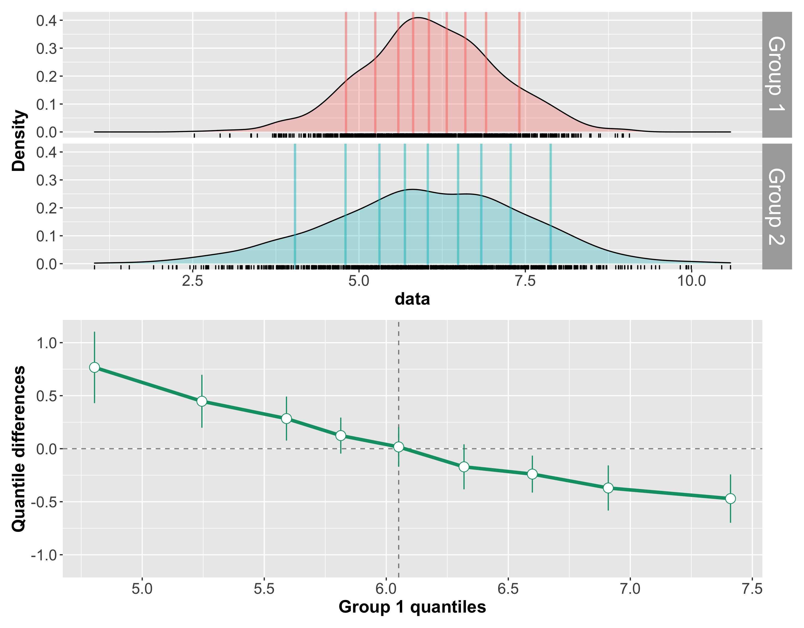
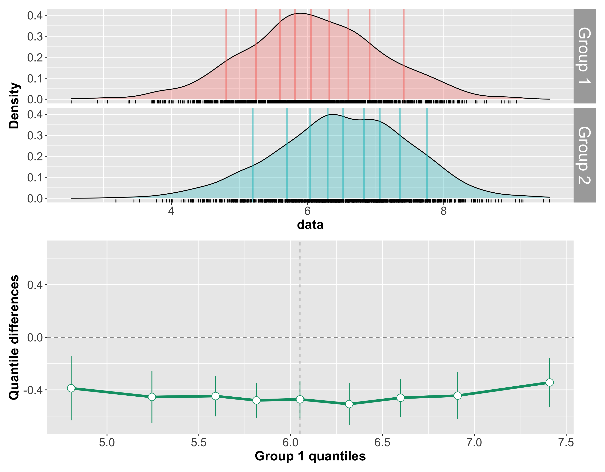

```{r load-packages, include=TRUE, warning=FALSE}
library(tidyverse)
library(viridis)

theme_set(theme_grey(base_size = 14) +
            theme(panel.grid = element_blank()))
```

# Reaktionszeiten
In diesem Kapitel untersuchen wir Reaktionszeiten, welche, wie binäre Daten, in der kognitiven Neurowissenschaften sehr häufig anzutreffen sind. Drei häufig verwendete Tasks, um Reaktionszeiten zu messen sind 

- Reaction tasks
- Go/No Go tasks
- Discrimination tasks

Bei *Reaction tasks* muss auf einen Reiz reagiert werden, bei Go/No Go tasks muss zwischen zwei Reizen unterschieden, und nur auf einen reagiert werden. Discrimination tasks erfordern komplexere kognitive Leistungen, da eine von zwei Antworten gegeben werden muss, in Abhängigkeit des Reizes. 

Wenn wir Reaktionszeiten messen , gehen wir gehen davon aus, dass die Zeit, die benötigt wird, um einen Task auszuführen, uns über den kognitiven Prozess Auskunft gibt. Dabei ist es aber wichtig, dass die Versuchsperson in dieser Zeit wirklich genau den Task ausführt, und nicht nebenher noch andere Prozesse die Rektionszeit beeinflussen, da diese sonst bedeutungslos wäre. Leider ist dies nicht immer der Fall. Bei vielen repetitiven Tasks sind *attentional lapses* nicht zu vermeiden, und nur bei den einfachsten Tasks ist es möglich, sicherzustellen, dass die VP auch wirklich den intendierten Task ausführt.


## Eigenschaften von Reaktionszeiten 

Die wichtigsten Merkmale von Reaktionszeiten sind 

1) Sie sind rechtsschief
2) Sie sind nicht normalverteilt
3) Streuung (Standardabweichung) steigt ungefähr linear mit wachsendem Mittelwert [@wagenmakersLinearRelationMean2007]


Die Rechtschiefe ist eine natürliche Konsequenz der Tatsache, dass es viele Möglichkeiten gibt, langsamer zu werden, aber nur wenige Möglichkeiten, schneller zu werden. Ausserdem gibt es eine Untergrenze, welche durch unsere Physiologie bestimmt ist. Schellere Reaktionszeiten als 200 Millisekunden sind kaum möglich, und Reaktionszeiten können nicht negativ werden.

Die Konsequenz daraus ist dass Reaktionszeiten nicht normalverteilt sind. In folgender Grafik sind zwei Verteilungen dargestellt. Die gelbe Verteilung ist eine Normalverteilung mit $\mu = 1$ und $\sigma = 0.4$, während die graue Vreteilung eine LogNormal Verteilung darstellt.

<aside>
Eine LogNormal-Verteilung bedeutet, dass der Logarithmus einer Zufallsvariablen normalverteilt ist.
</aside>


```{r echo=FALSE}
tibble(norm = rnorm(1e4, 1, 0.4), 
       lognorm = rlnorm(1e4, 0, 1)) %>% 
  pivot_longer(everything(), names_to = "Distribution", values_to = "value") %>% 
  ggplot(aes(value, fill = Distribution)) +
  geom_histogram(alpha = 0.4, position = "identity", color = "black", binwidth = 0.1) +
  # geom_density(alpha = 0.6) +
  geom_vline(xintercept = 0, linetype = 3) +
  scale_fill_viridis(discrete = TRUE, option = "E") +
  coord_cartesian(xlim = c(-2, 8))
```

Obwohl die Normalverteilung so aussieht, als könne sie Reaktionszeiten repräsentieren, ist der Wertebereich von $[-\Inf, \Inf] nicht dafür geeignet. Ausserdem erlaubt die Normalverteilung keine extremen Werte, und ist nicht asymmetrisch.


## Beipiel
  
Wir illustrieren anhand eines Beispiels, wie Reaktionszeiten dennoch häufig analysiert werden, wie wenn sie normalverteilt wären. Reaktionszeiten werden häufig mit ihrem Mittelwert oder Median zusammengefasst.

Wir untersuchen Daten aus einem Online-Experiement mit 3 Blöcken. In jedem Block mussten Versuchspersonen einen anderen Task ausführen.

1) Reaction task

Versuchspersonen drücken SPACE-Taste wenn ein Stimulus erscheint (Quadrat oder Kreis). Outcome Variable ist die Reaktionszeit.


2) Go/No-Go task

Versuchspersonen drücken SPACE-Taste wenn Target erscheint (entweder Quadrat oder Kreis). Outcome Variablen sind Reaktionszeit und Antwort.

3) Discrimination task

Versuchspersonen drücken F-Taste wenn ein Quadrat erscheint, J-Taste wenn ein Kreis erscheint. Outcome Variable sind Reaktionszeit und Antwort.


**Annahme**: Versuchspersonen brauchen im Reaction task am wenigsten Zeit, um eine korrekte Antwort zu geben, gefolgt vom Go/No-Go task. Im Discrimination task brauchen Versuchspersonen länger, um korrekte Antworten zu geben.


```{r}
mentalchronometry <- read_csv("https://raw.githubusercontent.com/kogpsy/neuroscicomplab/main/data/mental-chronometry.csv") %>% 
  mutate(across(c(subj, block, stimulus, handedness, gender), ~as_factor(.)))
```


```{r message=FALSE, warning=FALSE, layout="l-body-outset", fig.width=9, fig.height=4.5}
set.seed(98)
subjects <- sample(levels(mentalchronometry$subj), 3)
df <- mentalchronometry %>%
  filter(subj %in% subjects)

df %>% 
  ggplot(aes(RT, fill = block)) +
  geom_histogram(alpha = 0.8, position = "identity", color = "black") +
  scale_fill_viridis(discrete=TRUE, option="cividis") +
  facet_grid(block ~ subj, scales = "free_x") +
  theme(legend.position = "none")
```

```{r message=FALSE, warning=FALSE, layout="l-body-outset", fig.width=9, fig.height=4.5}
df %>% 
  filter(subj %in% subjects) %>% 
  ggplot(aes(y = RT, x = block, fill = block)) +
  geom_violin(alpha = 0.6) +
  geom_jitter(width = 0.1) +
  scale_fill_viridis(discrete=TRUE, option="cividis") +
  facet_wrap(~ subj, scales = "free_x") +
  theme(legend.position = "none")
```

:::exercise
1) Überlegen Sie sich, was Sie mit diesen Daten machen können.

2) Welche Kennzahlen eignen sich gut, um die Daten zu beschreiben?

3) Berechnen Sie die mittlere Reaktionszeit pro Block für jede Person individuell.

4) Berechnen Sie die mittlere Reaktionszeit pro Block über alle Personen aggregiert.
:::


## Daten zusammenfassen

Wir können ohne Ausreisser zu behandeln die Date pro Person pro Block mit Mittelwert, Median und Standarabweichung zusammenfassen.

```{r}
funs <- list(mean = mean, median = median, sd = sd)

by_subj <- mentalchronometry %>%
  group_by(subj, block) %>% 
  dplyr::summarise(across(RT, funs, .names = "{.fn}"))
```

```{r}
by_subj %>% 
  ggplot(aes(block, mean)) +
  geom_jitter(width = 0.1)
```

```{r}
by_subj %>% 
  ggplot(aes(block, median)) +
  geom_jitter(width = 0.1)
```


```{r}
by_subj %>% 
  ggplot(aes(block, sd)) +
  geom_jitter(width = 0.1)
```


```{r}
by_subj %>% 
  ggplot(aes(mean, sd, color = block)) +
  geom_point() +
  scale_color_viridis(discrete = TRUE, option = "E")
```


Nun können wir die Mittelwerte einzelnen Blöcke als Mittelwerte der personspezifischen Mittelwerte oder Mediane berechnen.

```{r}
aggregated_mean <- Rmisc::summarySEwithin(by_subj,
                                     measurevar = "mean",
                                     withinvars = "block",
                                     idvar = "subj",
                                     na.rm = FALSE,
                                     conf.interval = .95)
```

```{r}
aggregated_mean %>% 
  ggplot(aes(block, mean, fill = block)) +
  geom_col(alpha = 0.8) +
  geom_line(aes(group = 1), linetype = 3) +   
  geom_errorbar(aes(ymin = mean-se, ymax = mean+se),
                width = 0.1, size=1, color="black") +
  scale_fill_viridis(discrete=TRUE, option="cividis") +
  theme(legend.position = "none")
```
Sowohl Mittelwert als auch Median sind jedoch problematisch als Masse der zentralen Tendenz für asymmetrische Verteilungen. Der Mittelwert kann durch eine hohe Schiefe und Ausreissern verschoben werden, und repräsentiert die zentrale Tendenz der Verteilung nicht besonders gut. Der Median ist ein besseres Mass für eine typische Beobachtung aus dieser Verteilung, ist jedoch nicht immer erwartungstreu.


## Data cleaning

Wir können versuchen Ausreisser zu identifizieren.


### Cleaning by subject


Unser Ziel ist es, die Daten einer Versuchsperson zu entfernen, falls diese Person in einer experimentellen Bedingung eine mittlere RT hat, welche mehr als 2 Standardabweichungen vom Gesamtmittelwert liegt.


```{r}
# summary stats (means) for participants
sum_stats_participants <- mentalchronometry %>% 
  group_by(subj, block) %>% 
  dplyr::summarise(
    mean_P = mean(RT))

# summary stats (means and SDs) for conditions
sum_stats_conditions <- mentalchronometry %>% 
  group_by(block) %>% 
  dplyr::summarise(
    mean_C = mean(RT),
    sd_C = sd(RT))
  
sum_stats_participants <- 
  full_join(
    sum_stats_participants,
    sum_stats_conditions,
    by = "block") %>% 
  mutate(
    outlier_P = abs(mean_P - mean_C) > 2 * sd_C)

# show outlier participants
sum_stats_participants %>% 
  filter(outlier_P == 1) %>% 
  show()
```

Wir haben also eine Person, welche in einer Bedingung (`discrimination`) eine mittlere RT hat, welche mehr als 2 Standardabweichungen vom Gesamtmittelwert dieser Bedingung liegt. 


Weiter können wir die RT für jeden Trial in jeder Bedingung plotten. Es ist klar, dass die mittlere RT im `discrimination` aufgrund mehrerer Ausreisser zustande kommt.


```{r}
mentalchronometry %>% 
  semi_join(sum_stats_participants %>% filter(outlier_P == 1), 
    by = c("subj")) %>% 
  ggplot(aes(x = trial_number, y = RT)) +
  geom_point() +
  facet_wrap(~block)
```

Wir könnten diese Person ganz ausschliessen.


```{r}
excluded <- sum_stats_participants %>% 
  filter(outlier_P == 1)

excluded
```

```{r}
mentalchronometry_cleaned <- mentalchronometry %>% 
  filter(!(subj %in% excluded$subj)) %>% 
  mutate(subj = fct_drop(subj))
```


### Cleaning by trial

Nun wollen alle Trials identifizieren, welche mehr als 2 Standardabweichungen vom Bedingungs-Gesamtmittelwert liegen. Ausserdem entfernen wir alle RTs, welche unter 100 Millisekunden liegen.

```{r}
# mark individual trials as outliers
mentalchronometry_cleaned <- mentalchronometry_cleaned %>% 
  full_join(
    sum_stats_conditions,
    by = "block") %>% 
  mutate(
    trial_type = case_when(
      abs(RT - mean_C) > 2 * sd_C ~ "zu weit vom Mittelwert",
      RT < 100 ~ "< 100ms",
      TRUE ~ "OK") %>% 
      factor(levels = c("OK", "< 100ms", "zu weit vom Mittelwert")),
    trial = row_number())
```

```{r layout="l-body-outset", fig.width=9, fig.height=4.5}
# visualize outlier trials

mentalchronometry_cleaned %>% 
  ggplot(aes(x = trial, y = RT, color = trial_type, shape = trial_type)) +
  geom_point(alpha = 0.6) + 
  geom_point(data = filter(mentalchronometry_cleaned, trial_type != "OK"), 
             alpha = 0.9) + 
  facet_grid(~block) +
  scale_color_manual(values = c("gray70", "red", "steelblue"))
```

Wir haben insgesamt 63 Trials, welche nach unseren Kriterien Ausreisser sein könnten.

```{r}
mentalchronometry_cleaned %>% 
  filter(trial_type != "OK")
```
Diese 63 Trials entfernen wir nun.

```{r}
mentalchronometry_cleaned <- mentalchronometry_cleaned %>% 
  filter(trial_type == "OK")
```


```{r}
mentalchronometry_cleaned %>% 
  ggplot(aes(x = RT, color = block, fill = block)) +
  geom_density(alpha = 0.3) +
  scale_fill_viridis(discrete=TRUE, option="cividis") +
  scale_color_viridis(discrete=TRUE, option="cividis")
```


```{r}
by_subj_cleaned <- mentalchronometry_cleaned %>%
  group_by(subj, block) %>% 
  dplyr::summarise(across(RT, funs, .names = "{.fn}"))
```

```{r}
aggregated_cleaned <- Rmisc::summarySEwithin(by_subj_cleaned,
                                     measurevar = "mean",
                                     withinvars = "block",
                                     idvar = "subj",
                                     na.rm = FALSE,
                                     conf.interval = .95)
```

```{r}
aggregated_cleaned %>% 
  ggplot(aes(block, mean, fill = block)) +
  geom_col(alpha = 0.8) +
  geom_line(aes(group = 1), linetype = 3) +   
  geom_errorbar(aes(ymin = mean-se, ymax = mean+se),
                width = 0.1, size=1, color="black") +
  scale_fill_viridis(discrete=TRUE, option="cividis") +
  theme(legend.position = "none")
```


Ein soches Data Cleaning ist zwar in den meisten Fällen notwendig,  aber leider etwas willkürlich, und gibt dem Forscher/der Forscherin sehr viele Freiheiten (researcher degrees of freedom). Es ist deshlab wichtig, Ausschlusskriterien für Personen und einzelne Trials vor der Analyse festzulegen, und offen zu berichten.

## Shift Function

In den Neurowissenschaften wird ein Vergleich zwischen Gruppen oder Bedingungen oft wie oben beschrieben durchgeführt. Wir machen dabei folgende Annahmen:

- Die RT Verteilungen unterscheiden sich nur in ihrer zentralen Tendenz, aber nicht in anderen Aspekten.
- Die typische Beobachtung kann durhc den Mittelwert repräsentiert werden, d.h. der Mittelwert ist eine ausreichende Statistik der Verteilung.

Diese Annahmen sind sehr stark, und meistens falsch. Es gibt keinen Grund anzunehmen, dass sich  Unterschiede in RT Verteilungen nur in der zentralen Tendenz manifestieren. 


Anstelle einer Zusammenfassung anhand von Mittelwert und Standardabweichung können wir auch anhand von Grafiken und informativeren Kennzahlen die Unterschiede zwischen Verteilungen darstellen.

- t-Test und ANOVA sind nicht immer robust gegenüber Verletzungen der Annahmen und Ausreissern.
- Keine Signifikanz ist keine Evidenz für einen fehlenden Effekt
- Verteilungen können dieselbe zentrale Tendenz haben, sich aber in den Extrembereichen unterscheiden.


Grafik \@ref(fig:rousselet2016) zeigt eine traditionelle Level 1 / Level 2 Analyse. In diesem Datensatz wurden 2 Gruppen (between) in 2 Bedingungen (within) getest. A) zeigt die Mittelwerte und Standarfehler. Eine ANOVA würde hier eine signifikante Gruppen x Bedingung Interaktion zeigen. B) zeigt die Unterschiede zwischen den Bedingungen für alle Vpn innerhalb der beiden Gruppen. C) zeigt, dass die Scores in Gruppe in Bediungung 2 grösser sind als in Bedingung 1. Weiter scheinen diese Differenzen grösser zu werden, mit wachsendem Score in Bedingung 1. Diese beide Zusammenhänge existieren nicht in Gruppe 2. D) zeigt einen Scatterplot der beiden Bedingungen. Während die Punkte der Gruppe 2 auf der geraden liegen, ist auch hier ersichtlich, dass bei Gruppe 1 der Unterschied zwischen den Bedingungen bei wachsendem SCore in Bedingung 1 ansteigt.
  
```{r rousselet2016, echo = FALSE, fig.height=5, fig.width=7, fig.cap="Grafische Darstellung von Reaktionszeiten (aus @rousseletFewSimpleSteps2016a). "}

```

Dies sind lediglich unterschiedliche Darstellungen derselben Daten. Eine Standardtest, wie z.B. eine ANOVA, bietet in diesem Fall nicht mehr Information als eine grafische Darstellung.

Sowohl der Mittelwert als auch der Median sind nicht ideal, um schiefe Verteilungen zusammenfassen. Solche Verteilungen sind asymmetrisch, und die Asymmetrie selber kann sich zwischen Bedingungen unterscheiden, so dass Masse der zentralen Tendenz und der Streuung nicht ausreichend sind (keine sogenannten *sufficient statistics*) [@rousseletFewSimpleSteps2016a].


Ein Ansatz, um die ganze Verteilung zu benutzen, anstatt die Verteilung durch eine Kennzahl zusammenzufassen, ist die empirischen Quantile der Daten zu berechnen. Wenn wir zwei Gruppen oder Bedingungen vergleichen möchten, können wir zum Beispiel die Dezile  berechen, und dann für jedes Dezil die Differenz berechen. Wenn wir anschliessend die Quantile einer Bedingung gegen die Differenzen plotten, erhalten eine sogennante **Shift Function**. Diese hat ihren Namen, weil sie anzeigt, in welche Richtung und um wieviel man eine Verteilung verschieben muss, um sie einer anderen Verteilung anzugleichen.


<aside>
Wir können auch andere, willkürlich gewählte, Quantil benutzen, aber die Dezile sind ein gute Kompromiss. Mit 9 Quantilen können wir die meisten Verteilungen ziemlich gut zusammenfassen.
</aside>

### Beispiel 1: unterschiedliche Streuung


```{r echo=FALSE}

```

    
Die erste Grafik ziegt 2 RT Verteilungen, welche sich bezüglich ihrer Streuung, aber nicht ihrer zentralen Tendenz unterscheiden. Die eingezeichneten Linien sind die Dezile der Verteilung. Bei Gruppe 2 sind die äusseren Dezile im Vergleich zur Gruppe 1 extremer. Die zweite Grafik zeigt die Dezile der 1. Grupper auf der X-Achse, und die Differenzen der Dezile (Gruppe 1 - Gruppe 2) auf der Y-Achse.

Wir können die Grafik so lesen: Im Median unterscheiden sich die Gruppen nicht. Bei den oberen Dezilen ist die Differenz negativ, d.h. Gruppe 1 hat kleinere Werte als Gruppe 2. Dies bedeutet, dass man die oberen Dezilen der Gruppe 2 nach links verschieben müsste, um sie gleich der Gruppe 1 zu machen.

Bei den unteren Dezilen haben wir das umgekehrte Muster. Hier sind die Differenzen positiv, was bedeutet, dass wir wir unteren Quantile der Gruppe 2 nach rechts verschieben müssten. Gruppe 2 hat als schnellere kurze und längere langsame Reaktionszeiten.


### Beispiel 2: unterschiedliche zentrale Tendenz und Streuung


```{r echo=FALSE}

```

In diesem Beispiel sind alle Dezile der Gruppe 2 gegenüber der Gruppe 1 nach rechts verschoben. Die Shift Funktion ist dementsprechend beinahe eine gerade Linie. Bei jedem Dezil müssten wir die Gruppe 2 uniform nach links verschieben, um sie der Gruppe 2 anzunähern. Hier kann man also sagen, dass Gruppe 1 schneller als Gruppe 2 ist.


### Beispiel 3: Positive right tail shift


```{r echo=FALSE}

```


Im dritten Beispiel unterscheiden sich die beiden Gruppen vor allem am rechten Ende der Verteilung, während die Gruppen sich in dem unteren Dezile nicht unterscheiden. Dies führt zu einer Differenz von Null bis zum Median, und einer steigenden Differenz in den oberen Dezilen.


## Shift Function von Hand


Eine Shift Function von Hand zu berechen ist relativ einfach, aber selbstverständlich gibt es dafür ein R Package (`rogme`). Hier werden wir aber zunächst für eine Person in zwei Bedingungen die Quantile per Hand berechnen, um ein Verständnis dafür zu entwicklen, wie eine Shift Function verwendet werden kann.


Wir wählen aus dem `mentalchronometry` Dataframe, aus dem die Ausreisser entfernt wurden, eine Person und die beiden Tasks `goNoGo` und `discrimination` aus.

```{r}
set.seed(294)
subject <- with(mentalchronometry_cleaned, sample(levels(subj), 1))

df <- mentalchronometry_cleaned %>% 
  filter(subj == subject,
         block != "reaction") %>% 
  mutate(subj = fct_drop(subj))
```


```{r}
deciles <- seq(0.1, 0.9, length.out = 9)

quantilefun <- function(x) {
  as_tibble(t(quantile(x$RT, probs = deciles, type = 8)))
}

df_quantiles <- df %>% 
  group_by(block) %>% 
  nest() %>% 
  mutate(quantiles = map(data, ~ quantilefun(.x))) %>% 
  unnest(quantiles) %>% 
  pivot_longer(`10%`:`90%`, names_to = "quantile", values_to = "RT") %>% 
  arrange(block)
```

```{r}
df_quantile_differences <- df_quantiles %>% 
  select(-data) %>% 
  pivot_wider(names_from = "block", values_from = "RT") %>% 
  mutate(`goNoGo - discrimination` = goNoGo - discrimination)
```


```{r}
df_quantile_differences %>% 
  ggplot(aes(x = goNoGo, y = `goNoGo - discrimination`)) +
  geom_line(aes(group = 1), color = "steelblue", size = 2) +
  geom_point(shape = 21, color = "steelblue", fill = "white", size = 5, stroke = 1) +
  geom_hline(yintercept = 0, linetype = 3) +
  coord_cartesian(ylim = c(-100, 100))
```
```{r}
df %>% 
  ggplot(aes(x = RT, color = block, fill = block)) +
  geom_density(alpha = 0.3) +
  scale_fill_viridis(discrete=TRUE, option="cividis") +
  scale_color_viridis(discrete=TRUE, option="cividis")
```
:::exercise
Versuchen Sie nun, ein Shift Function für zufällig ausgewählte Versuchspersonen in 2 beliebig ausgewählen Bedingungen grafisch darzustellen.
:::


## Reaktionszeitverteilungen

:::exercise
[Reaction time distributions: an interactive overview](https://lindeloev.shinyapps.io/shiny-rt/)
:::
