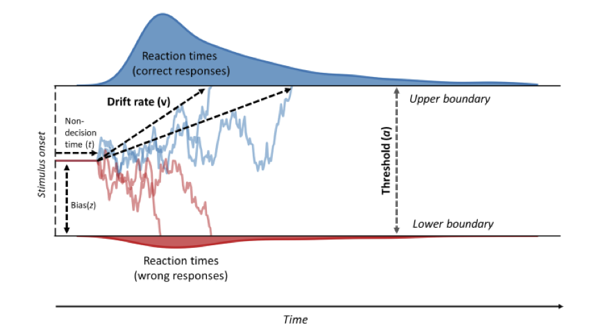

```{r load-packages, include=TRUE, warning=FALSE}
library(tidyverse)
library(viridis)

theme_set(theme_grey(base_size = 14) +
            theme(panel.grid = element_blank()))
```


# Entscheidungen

In der letzten Sitzung haben wir Daten aus einem Lexical Decision Task angeschaut, bei dem Versuchspersonen einen Stimulus in eine von zwei Antwortkategorien einteilen mussten. Dabei haben wir die Reaktionszeiten von korrekten Antworten angeschaut. Diese Art von Experimenten wird sehr häufig verwendet, und wird oft **choice response time** Task genannt. 

Wenn wir aber nur die korrekten Antworten betrachten, ignorieren wir sehr viel Information, die verwendet werden könnte, um etwas über die kognitiven Prozesse ausssagen zu können, welche dieser Art von Entscheidung zugrunde liegen könnten. Zum Beispiel wissen wir, dass die Fehler, welche Menschen in einer Speed-Stress Bedingung machen, schneller als korrekte Antworten sind, während in einer Accuracy-Stress Bedingung Fehler eher langsamer als korrekte Antworten sind. Solche Befunde sind schwierig zu erklären, ohne dass man dafür mathematische Modelle macht.

Aus diesem Grund hat Roger Ratcliff Ende der 70er Jahre das Diffusion Decision Modell (DDM=) entwickelt, welches eine Entscheidung zwischen zwei Alternativen in mehrere kognitive Komponenten zerlegt, und sowohl die Antworten als auch die Reaktionszeiten erklären kann [@ratcliffDiffusionDecisionModel2008b]. Auf seiner Website führt Ratcliff ine Liste von Anwendungen des DDM, z.B. für ADHS, Altern, Depression, etc.


# Diffusion Decision Model

Das von Ratcliff entwickelte Modell hat seinen Ursprung in Modellen zu den Bewegungen von Partikeln in einer Flüssigkeit, und geht auf Arbeiten von Albert Einstein und [Norbert Wiener](https://en.wikipedia.org/wiki/Norbert_Wiener) zurück. 

<aside>
Hier schauen wir uns eine vereinfachte Version dieses Modells an.
</aside>

Die Grundidee ist, dass wir Evidenz für die eine oder die andere Antwortalternative brauchen, um eine Entscheidung zu treffen, und dass diese Evidenz über die Zeit akkumuliert wird. Diese Evidenz wird, je nach Task, von einem Teil unseres Gehirns verarbeitet, so dass sie für die Entscheidung zur Verfügung steht. Wenn wir beispielsweise eine perzeptuelle Entscheidung modellieren, wie etwa die Entscheidung, ob sich etwas nach rechts oder links bewegt, nehmen wir an, dass die Evidenz von den kortikalen Arealen verarbeitet wird, welche für Bewegungswahrnehmung zuständig sind. Diese Evidenz wird dann kontinuerlich einem Decision Process verfügbar gemacht, und zwar in Form einer Verteilung.


In dem Modell wird angenommen, dass pro Zeiteinheit eine Zufallszahl aus dieser Evidenzverteilung gezogen wird, so dass positive Werte als Evidenz für die eine Antwortalternative gezählt wird, während negative Werte als Evidenz für die andere Antwortalternative gezählt wird. Diese Evidenz, welche oft **Decision Variable** genannt wird, wird über die Zeit aufsummiert, bis entweder eine obere oder eine untere Grenze erreicht wird. Ist das der Fall, wird eine Antwort ausgelöst. Die Tendenz der Decision Variable, auf- oder abzusteigen, nennt man **drift rate**. 

In Experimenten zum Bewegungssehen wird oft ein 'random dot motion' task verwendet. Hier muss entschieden werden, ob sich eine Punktwolke nach rechts oder nach links bewegt. Es wird hier angenommen, dass die drift rate von der Stimulusstärke abhängt; in diesem Fall ist das die Kohärenz, d.h. der Anteil der Punkte, welcher sich kohärent in eine Richtung bewegt.

<aside>
```{r echo=FALSE}
knitr::include_graphics("images/dots.jpg")
```

```{r echo=FALSE}
knitr::include_graphics("images/dotsddm.jpg")
```
</aside>

Die Distanz zwischen den Grenzen wird **threshold** gennant, und der Anfangspunkt der Evidenzakkumulierung wird **bias** genannt. Die letzte wichtige Komponente dieses Modells ist die **non-decision time**. Darunter werden alle Prozesse zusammengefasst, welche ausgefährt werden müssen, jedoch nicht direkt mit der Entscheidung zu tun haben. Darunter fällt z.B. die Ausführung der Antwort durch das motorische System, aber auch die sensorische Verarbeitung.

```{r echo=FALSE, fig.cap = "Figure from @vindingVolitionProspectiveMemory2018",  layout="l-body-outset", fig.width=6, fig.height=5.}

```


# Model in R

In R können wir die aktuelle Decision Variable zu Zeitpunkt $t$ als normalverteilte Zufallszahl modellieren, bei der `evidence` den Mittelwert der Evidenz repräsentiert, und `sd` die Standardabweichung

```{r}
drift <- 0.3
sd <- 0.2
dv <- rnorm(n = 1, mean = drift, sd = sd)
```

Wenn wir dies nun über einen Zeitraum wiederholen, und die `dv` Werte aufsummieren, erhalten wir einen `random walk` mit einem Drift in die Richtung der durchschnittlichen Evidenz.

```{r}
n_steps <- 10
evidence <- rep(NA, n_steps)
dv <- rep(NA, n_steps)

time_steps <- 1:n_steps

# Wir ziehen den ersten Wert aus der Verteilung
evidence[1] <- rnorm(1, mean = drift, sd = sd)
dv[1] <- evidence[1]

# für jeden weitern Zeitpunkt ziehen wir wieder eine Zufallszahl und addieren zur kumulierten DV
for (t in time_steps[-1]) {
    evidence[t] <- rnorm(1, mean = drift, sd = sd)
    dv[t] <- dv[t-1] + evidence[t]
}
```

```{r}
tibble(time_steps, evidence, dv) %>% 
    pivot_longer(c(evidence, dv), names_to = "type", values_to = "value") %>% 
    ggplot(aes(time_steps, value, linetype = type, color = type)) +
    geom_line() +
    geom_point(size = 4) +
    scale_color_viridis_d(begin = 0.2, end = 0.5)
```

Die Decision Variable repräsentiert nun die kumulierten Evidenz, aufgrund dessen das Gehirn eine Entscheiung treffen kann. Wenn die Decision Varaible entweder grösser als die ober Grenze ist, oder kleiner als die untere Grenze, wird die Evidenzakkumulierung abgebrochen, und eine Antwort wird ausgelöst. Wir können nun noch die "non-decision time" hinzufügen, und den Anfangspunkt der Evidenzakkumulierung. Dieser Anfangspunkt ist ein sehr wichtiger Parameter, denn wenn der Anfagnspunkt nicht genau in der Mitte zwischen den beiden Grenzen liegt, dann braucht es natürlich weniger Evindenz, um die Grenze zu erreichen, welche näher beim Anfangspunkt liegt.


```{r code_folding=TRUE}
drift_diffusion <- function(bias = 0.5,
                            driftrate = 0.8,
                            decision_boundary = 2,
                            ndt = 0.5,
                            diffvar = 0.1,
                            dt = 0.001,
                            max_time = 6) {

    assertthat::assert_that(diffvar > 0)

    # rescale bias so that 0.5 lies halfway between upper and lower bound
    bias <- as.numeric(2 * decision_boundary * bias - decision_boundary)

    # initialize time_steps and dv
    time_steps <- max_time/dt
    dv <- array(dim = time_steps)

    # start acumulating from bias (starting point)
    dv[1] <- rnorm(1, mean = bias, sd = sqrt(dt))

    for (j in 2:time_steps) {

        # non-decision time
        if (j <= ndt/dt) {
            dv[j] <- dv[j-1]
        }
        else {
            error <- rnorm(1, 0, sqrt(diffvar * dt))
            dv[j] <- dv[j-1] + driftrate * dt + error  # Cobb & Zacks (1985), Eq. 1.14
            if (abs(dv[j]) > decision_boundary) {
                dv[j] <- dplyr::if_else(dv[j] > 0,
                                 min(dv[j], decision_boundary),
                                 max(dv[j], -decision_boundary))
                break()
            }
        }
    }
    d <- dplyr::tibble(time = round(seq_along(dv) * dt, 2),
                         dv = dv,
                         steps = seq_along(dv),
                         driftrate = driftrate,
                         decision_boundary = decision_boundary,
                         bias = bias,
                         ndt = ndt)
    return(d)
}
```


Wir können nun einige Trials plotten, um den Effekt dieser Parameter zu visualisieren.


```{r}
set.seed(829)

slow <- drift_diffusion(driftrate = 0.8) %>% mutate(type = "slow")
fast <- drift_diffusion(driftrate = 1.2) %>% mutate(type = "fast")

fastslow <- bind_rows(fast, slow) 

fastslow %>% 
    ggplot(aes(time, dv, color = type)) +
    geom_hline(yintercept = 0, linetype = 3) +
    geom_line() +
    scale_color_viridis_d(end = 0.8) +
    geom_hline(yintercept = c(-2, 2), color = "black", size = 1) +
    ggtitle("Grosse vs. kleine Drift Rate")
```


```{r}
set.seed(29)

unbiased <- drift_diffusion(bias = 0.5) %>% mutate(type = "unbiased")
upbiased <- drift_diffusion(bias = 0.7) %>% mutate(type = "upbiased")
downbiased <- drift_diffusion(bias = 0.3) %>% mutate(type = "downbiased")


bias <- bind_rows(unbiased, upbiased, downbiased) 

bias %>% 
    ggplot(aes(time, dv, color = type)) +
    geom_hline(yintercept = 0, linetype = 3) +
    geom_line() +
    scale_color_viridis_d(end = 0.8) +
    geom_hline(yintercept = c(-2, 2), color = "black", size = 1) +
    ggtitle("Anfangspunkte")
```


```{r}
set.seed(829)

careless <- drift_diffusion(decision_boundary = 1.6) %>% mutate(type = "careless")
cautious <- drift_diffusion(decision_boundary = 2.1) %>% mutate(type = "cautious")

cautiouscareless <- bind_rows(careless, cautious) 

decision_boundaries <- tribble(~type, ~decision_boundary,
                               "careless", 1.6,
                               "cautious", 2.1)
cautiouscareless %>% 
    ggplot(aes(time, dv, color = type)) +
    geom_hline(yintercept = 0, linetype = 3) +
    geom_line() +
    scale_color_viridis_d(end = 0.8) +
    geom_hline(aes(yintercept = decision_boundary, color = type), data = decision_boundaries) +
    geom_hline(aes(yintercept = -decision_boundary, color = type), data = decision_boundaries) +
    ggtitle("Unterschiede im Abstand zwischen den Grenzen")
```


```{r}
set.seed(4534)

longndt <- drift_diffusion(ndt = 0.7) %>% mutate(type = "longndt")
shortndt <- drift_diffusion(ndt = 0.2) %>% mutate(type = "shortndt")

ndt <- bind_rows(longndt, shortndt) 

ndts <- tribble(~type, ~ndt,
                "longndt", 0.7,
                "shortndt", 0.2)

ndt %>% 
    ggplot(aes(time, dv, color = type)) +
    geom_hline(yintercept = 0, linetype = 3) +
    geom_line() +
    scale_color_viridis_d(end = 0.8) +
    geom_vline(aes(xintercept = ndt, color = type), data = ndts) +
    geom_hline(yintercept = c(-2, 2), color = "black", size = 1) +
    ggtitle("Unterschiede in der Non-Decision Time")
```


# Simulationen


Die Verteilungsfunktion sind im R Package `rtdists` enthalten. Damit können zum Beispiel Zufallszahlen aus der DDM Verteilung ziehen, ohne dass wir den Prozess wie oben Schritt für Schritt modellieren müssen.


```{r}
library(rtdists)
```


Wir können so ein Experiment simulieren, bei dem die Fehler im Schnitt schneller als die korrekten Antworten sind.

```{r}
rts <- rdiffusion(500, a = 1, v = 2, t0 = 0.5, z = 0.3)

glimpse(rts)
```

```{r}
head(rts)
```


```{r}
rts %>% 
    ggplot(aes(rt, response, fill = response)) +
    geom_violin() +
    scale_fill_viridis_d(option = "B", direction = -1, 
                       begin = 1/3, end = 3/3)
```


```{r}
rts %>% 
    group_by(response) %>% 
    summarise(mean = mean(rt),
              median = median(rt),
              sd = sd(rt))
```


# Beispiele aus den kognitven Neurowissenschaften

