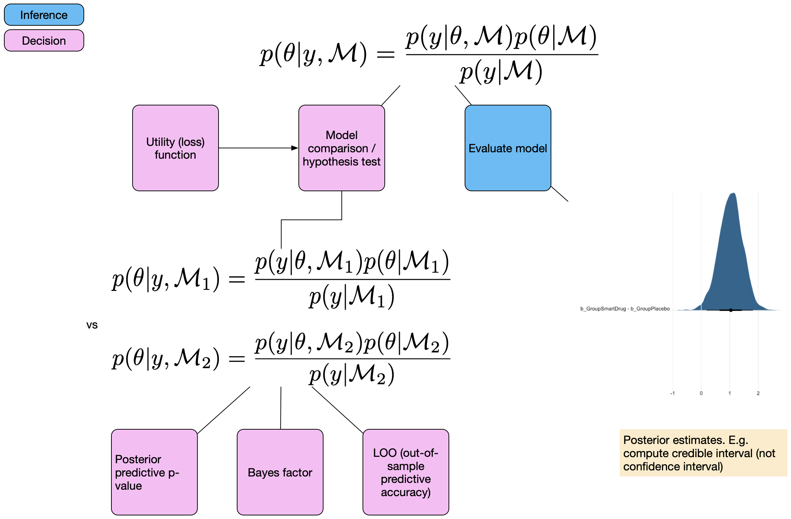

```{r child = "setup.Rmd"}
```

```{r load-packages, include=FALSE, warning=FALSE}
library(tidyverse)
library(rmarkdown)
library(kableExtra)
library(countdown)

theme_set(theme_grey(base_size = 14) +
            theme(panel.grid = element_blank()))
```


## Einführung


.pull-left[
Bisher haben wir:

- Parameter geschätzt
    + Binomial (Bernoulli) Modell
    + Lineare Modelle mit kategorialem Prädiktor
- Posterior Verteilung(en) zusammengefasst
    + Credible Intervals
    + Highest Posterior Density Intervals

]

--

.pull-right[
Wir würden gerne Aussagen über die Wahrscheinlichkeiten von Modellen machen:

- z.B. Modell 1 (M1) erklärt die Daten besser als Modell 2 (M2).
- M1 ist wahrscheinlicher als M2

Solche Aussagen sind **Modellvergleiche**.
]


---

.pull-left[
.discussion[
Welche Methoden kennen Sie, um Modelle zu vergleichen?


- Diskutieren Sie anhand dieses Beispiels, wie Sie die Hypothese testen können, dass die Intervention einen Effekt hat.
]
]

.pull-right[


```{r include=FALSE}
library(tidyverse)
intervention <- rep(c('treat', 'control'), each = 5)
pre <- c(20, 10, 60, 20, 10, 50, 10, 40, 20, 10)
post <- c(70, 50, 90, 60, 50, 20, 10, 30, 50, 10)

dwide <- tibble(id = factor(1:10), 
            intervention, pre, post) %>% 
  mutate(diff = post - pre,
         id = as_factor(id), 
         intervention =  factor(intervention, levels = c("control", "treat")))
d <- dwide %>% 
  select(-diff) %>% 
  pivot_longer(cols = pre:post, names_to = "time", values_to = "score") %>% 
  mutate(time = as_factor(time))
```

Wir haben hier einen within (messwiederholten) Faktor (`time`), und einen between Faktor (`intervention`). 


```{r echo=FALSE, eval=TRUE}
d %>% 
  ggplot(aes(time, score, color = intervention)) +
  geom_line(aes(group = id), linetype = 1, size = 1) +
  geom_point(size = 4) +
  scale_color_viridis_d(end = 0.8) 
```


]

```{r echo=FALSE}
countdown(minutes = 3)
```

---

## Mögliche Methoden

- Hypothesentest, z.B.

.pull-left[
```{r eval=FALSE, include=TRUE}
t.test(diff ~ intervention,
       data = dwide)
```
]
.pull-right[
```{r eval=FALSE, include=TRUE}
m1 <- lmer(score ~ intervention + time + (1|id), 
                  data = d)
m2 <- lmer(score ~ intervention * time + (1|id), 
                  data = d)
```

]

- Modellvergleiche

    - Varianzaufklärung

    - Informationskriterien

    - Kreuzvalidierung

--

Wir lernen nun Methoden kennen, um mit Bayesianischen Modellen Modellvergleiche durchzuführen.

---

class: middle

.pull-left-narrow[
  .huge-blue-number[1]
]
.pull-right-wide[
  .larger[
  Theorie
  ]
]


---

## Bayesianische Modellvergleiche

Wir unterscheiden 3 verschiedene Methoden

1) Bayes Factors

2) Out of sample predictive accuracy:

> Approximate leave-one-out cross validation (LOO)

> Informationskriterien: widely application information criterion (WAIC)
    
3) Posterior predictive checking:
  > Konstruktion einer Teststatistik und Vergleich der aktuellen Daten mit generierten Daten aus der Posterior Predictive Distribution.

--

Heute schauen wir uns die erste Methode (Bayes Factors) an. Diese sind unter Statistikern sehr umstritten. Psychologen wollen Hypothesen testen (Evidenz für/gegen Hypothesen), während in anderen Bereichen dies weniger verbreitet ist.

---

.panelset[
.panel[.panel-name[Bayesian workflow]

```{r echo=FALSE, fig.height=5, fig.width=7}
knitr::include_graphics("images/Bayesian-workflow-1.png")
```

]

.panel[.panel-name[Posterior evaluation]

```{r echo = FALSE, out.width="80%"}

```

]

.panel[.panel-name[Model comparison]

```{r echo = FALSE, out.width="80%"}
knitr::include_graphics("images/Bayesian-workflow-3.png")
```

]
]

---

## Bayes factor

Bayes' Theorem, mit expliziter Abhängigkeit der Parameter $\mathbf{\theta}$  vom Modells $\mathcal{M}$:


$$ p(\theta | y, \mathcal{M}) = \frac{p(y|\theta, \mathcal{M}) p(\theta | \mathcal{M})}{p(y | \mathcal{M})}$$

$\mathcal{M}$ bezieht sich auf ein bestimmtes Modell. 

--

$p(y | \mathcal{M})$ ist die Wahrscheinlichkeit der Daten (marginal likelihood), über alle möglichen Parameterwerte des Modells $\mathcal{M}$ integriert. Wir haben sie anfangs als Normierungskonstante bezeichnet.

--

.panelset[
.panel[.panel-name[Bayes Theorem]

$$ P(\theta|Data) = \frac{ P(Data|\theta) * P(\theta) } {P(Data)} $$
]
.panel[.panel-name[Bayes Theorem ohne Konstante]
$$ P(\theta|Data) \propto P(Data|\theta) * P(\theta) $$
]
.panel[.panel-name[Marginal likelihood]

$$ p(y | \mathcal{M}) = \int_{\theta}{p(y | \theta, \mathcal{M}) p(\theta|\mathcal{M})d\theta} $$
Bei der Berechnung der Marginal Likelihood muss über alle unter dem Modell möglichen Werte von $\theta$ gemittelt werden.

]
]

---

## Komplexität

- Marginal Likelihood wir auch __Model Evidence__ genannt. Sie hängt davon ab, welche Vorhersagen ein Model machen kann (warum?).

- Ein Modell, welches viele Vorhersagen machen kann, ist ein __komplexes__ Modell. Die meisten Vorhersagen werden aber falsch sein (warum?).


Komplexität hängt unter anderem ab von:

--

- Anzahl Parameter im Modell

- Prior Verteilungen der Parameter


---

## Prior Verteilungen

Uninformative Priors machen viele Vorhersagen, vor allem in Gegenden des Paramterraums, in denen die Lieklihood niedrig ist.


```{r include=FALSE}
n_points <- 100
p_grid <- seq( from=0 , to=1 , length.out = n_points )
likelihood <- dbinom(6 , size = 9 , prob = p_grid)


compute_posterior = function(likelihood, prior){
  # compute product of likelihood and prior
  unstandardized_posterior <- likelihood * prior
  
  # standardize the posterior, so it sums to 1
  posterior <- unstandardized_posterior / sum(unstandardized_posterior)
  
  par(mfrow=c(1, 3))
  plot(p_grid , prior, type="l", main="Prior", col = "dodgerblue3", lwd = 2)
  plot(p_grid , likelihood, type="l", main="Likelihood", col = "firebrick3", lwd = 2)
  plot(p_grid , posterior , type="l", main="Posterior", col = "darkorchid3", lwd = 2)
}
```


.panelset[
.panel[.panel-name[Uniformer Prior]
```{r}
prior <- dbeta(x = p_grid, shape1 = 1, shape2 = 1)
compute_posterior(likelihood, prior)
```
]

.panel[.panel-name[Informativer Prior]

```{r}
prior <- dbeta(x = p_grid, shape1 = 20, shape2 = 20)
compute_posterior(likelihood, prior)
```
]

.panel[.panel-name[Opiniated Prior (falsch)]

```{r}
prior <- dbeta(x = p_grid, shape1 = 2, shape2 = 40)
compute_posterior(likelihood, prior)
```
]

.panel[.panel-name[Opiniated Prior (besser)]

```{r}
prior <- dbeta(x = p_grid, shape1 = 30, shape2 = 48)
compute_posterior(likelihood, prior)
```
]
]

---

## Ockham's Razor

- Komplexe Modelle haben eine niedrigere Marginal Likelihood.

- Wenn wir bei einem Vergleich mehrerer Modelle diejenigen Modelle mit höherer Marginal Likelihood bevorzugen, wenden wir das __Prinzip der Sparsamkeit__ an.


--


Wir schreiben Bayes Theorem mit expliziten Modellen M1 und M2


$$ p(\mathcal{M}_1 | y) = \frac{P(y | \mathcal{M}_1) p(\mathcal{M}_1)}{p(y)} $$

und

$$ p(\mathcal{M}_2 | y) = \frac{P(y | \mathcal{M}_2) p(\mathcal{M}_2)}{p(y)} $$


--

Für Model $\mathcal{M_m}$ ist die Posterior Wahrscheinlichkeit des Modells proportional zum Produkt der Marginal Likelihood und der A Priori Wahrscheinlichkeit.


---

## Modellvergleich


Verhältnis der Modellwahrscheinlichkeiten:

$$ \frac{p(\mathcal{M}_1 | y) = \frac{P(y | \mathcal{M}_1) p(\mathcal{M}_1)}{p(y)}} {p(\mathcal{M}_2 | y) = \frac{P(y | \mathcal{M}_2) p(\mathcal{M}_2)}{p(y)}} $$

--

$p(y)$ kann rausgekürzt werden.


--


$$ \frac{p(\mathcal{M}_1 | y) = P(y | \mathcal{M}_1) p(\mathcal{M}_1)} {p(\mathcal{M}_2 | y) = P(y | \mathcal{M}_2) p(\mathcal{M}_2)} $$


--

<br>

$\frac{p(\mathcal{M}_1)}{p(\mathcal{M}_2)}$ sind die  **prior odds**, und $\frac{p(\mathcal{M}_1 | y)}{p(\mathcal{M}_2 | y)}$ sind die **posterior odds**.


---

Wir interessieren uns für das Verhältnis der Marginal Likelihoods:

$$ \frac{P(y | \mathcal{M}_1)}{P(y | \mathcal{M}_2)} $$

Dieser Term ist der **Bayes factor**: das ist der Term, mit dem die Prior Odds multipliziert werden, und gibt an, unter welchem Modell die Daten wahrscheinlicher sind.

--

Nehmen wir an, die Prior Odds seine $1$, dann interessiert uns nur der Bayes factor:

$$ BF_{12} = \frac{P(y | \mathcal{M}_1)}{P(y | \mathcal{M}_2)}$$

--


$BF_{12}$ gibt an, in welchem Ausmass die Daten $\mathcal{M}_1$ bevorzugen, relativ zu $\mathcal{M}_2$.

-- 

Beiepiel: $BF_{12} = 5$ heisst: die Daten sind unter Modell 1 5 Mal wahrscheinlicher als unter Modell 2 


---

## Klassifizierung

```{r echo = FALSE, out.width="80%"}
  knitr::include_graphics("images/bf-classification.png")
```


---

## Bayes Factor

- Sehr stark abhängig von den Prior Verteilungen der Parameter.

- Ist nur für sehr simple Modelle einfach zu berechnen/schätzen.

- Schätzmethoden
    + Savage-Dickey Density Ratio mit `Stan`/`brms`
    
    + Package [BayesFactor](https://cran.r-project.org/web/packages/BayesFactor/vignettes/manual.html) (nur für allgemeine lineare Modelle)
    
    + [JASP](https://jasp-stats.org/): IM Prinzip ein GUI für `BayesFactor`
    
    + Bridge sampling mit `brms`: schwieriger zu implementieren, aber für viele Modelle möglich.


---


```{r}
d <- data.frame(s = 9, k = 10)
```


```{r, echo = 1}
pd <- tibble(
  x = seq(0, 1, by = .01),
  Prior = dbeta(x, 1, 1)
)
ggplot(pd, aes(x, Prior)) +
  geom_line() +
  coord_cartesian(xlim = 0:1, ylim = c(0, 6), expand = 0.01) +
  labs(y = "Density", x = bquote(theta))
```


---

```{r preview = TRUE, echo = 1}
pd$Posterior <- dbeta(pd$x, 9+1, 1+1)
pdw <- gather(pd, key = Type, value = density, Prior:Posterior)
ggplot(pdw, aes(x, density, col = Type)) +
  geom_line() +
  scale_x_continuous(expand = expansion(0.01)) +
  labs(y = "Density") +
  annotate("point", x = c(.5, .5), y = c(pdw$density[pdw$x == .5])) +
  annotate("label",
    x = c(.5, .5),
    y = pdw$density[pdw$x == .5],
    label = round(pdw$density[pdw$x == .5], 3),
    vjust = -.5
  )
```

---

```{r echo = FALSE}
filter(pd, x == .5) %>%
  mutate(
    BF01 = Posterior / Prior,
    BF10 = 1 / BF01
  ) %>%
  kable(caption = "Bayes Factors for first example.", digits = 3) %>% 
  kable_styling(full_width = FALSE)
```


---

```{r message=FALSE, warning=FALSE}
library(brms)

m0 <- bf(
  s | trials(k) ~ 0 + Intercept,
  family = binomial(link = "identity")
)
```


```{r, message = F}
get_prior(m0, data = d)
```


```{r}
Prior <- set_prior("beta(1, 1)", class = "b", lb = 0, ub = 1)
```


```{r, results='hide'}
m <- brm(
  formula = m0,
  prior = Prior,
  data = d,
  sample_prior = TRUE,
  iter = 1e4,
  cores = 4,
  file = "models/05-m1"
)
```

---


```{r}
summary(m)
```


---


```{r echo = 1}
samples <- posterior_samples(m, "b")
head(samples) %>% 
  kable(digits = 2, caption = "Six first rows of posterior samples.") %>% 
  kable_styling(full_width = FALSE)
gather(samples, Type, value) %>%
  ggplot(aes(value, col = Type)) +
  geom_density() +
  labs(x = bquote(theta), y = "Density") +
  geom_vline(xintercept = .89) # Vertical line at .89
```


---

```{r echo = -1}
options(width = 120)
h <- hypothesis(m, "Intercept = 0.5")
print(h, digits = 4)
```


---


```{r}
plot(h)
```
